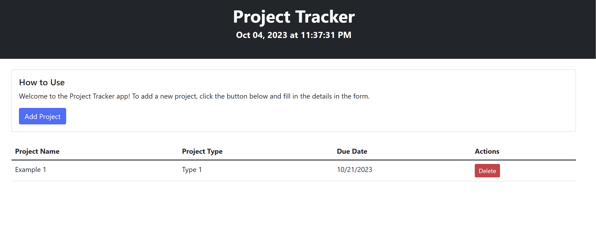

# Project Tracker by Juan Benazar

A simple project tracker application built with Bootstrap, Google Fonts, jQuery, and Day.js.

## Table of Contents

- [Description](#description)
- [How to Use](#how-to-use)
- [Screenshots](#screenshots)
- [Credits / what I used](#credits)

## Description

This project tracker allows you to add and manage project details, including the project name, type, and due date. It also displays the current date and time using Day.js.

## How to Use

1. Open the application in your web browser.

2. In the "Project Information" section, click the "Add Project" button.

3. Fill in the project details:
   - Project Name
   - Project Type (select from the dropdown)
   - Due Date (use the date input or jQuery UI datepicker)

4. Click the "Add" button to add the project to the list.

5. The project details will appear in the table below, and the row color will indicate if the project is past due (light red) or due today (light yellow).

6. To delete a project, click the "Delete" button in the corresponding row.

## Screenshots

## Credits

- Bootstrap: [Link to Bootstrap](https://getbootstrap.com/)
- Google Fonts: [Link to Google Fonts](https://fonts.google.com/)
- jQuery: [Link to jQuery](https://jquery.com/)
- Day.js: [Link to Day.js](https://day.js.org/)
